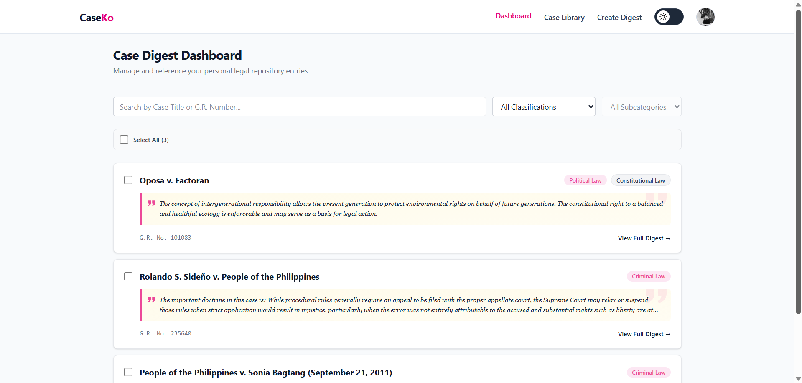
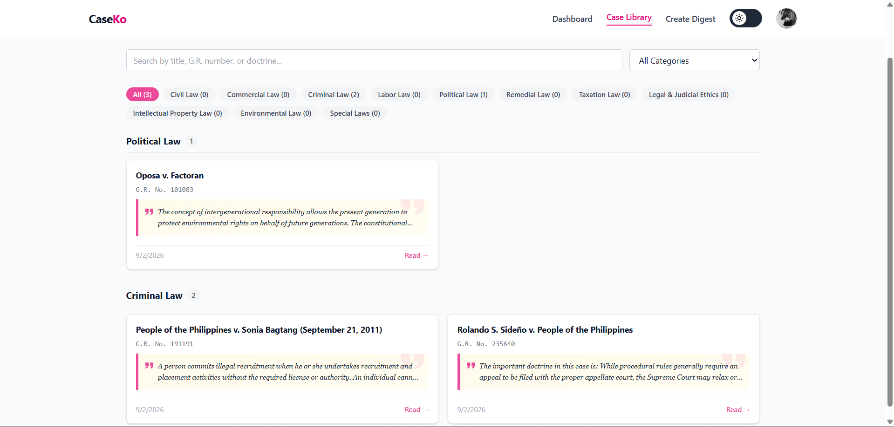
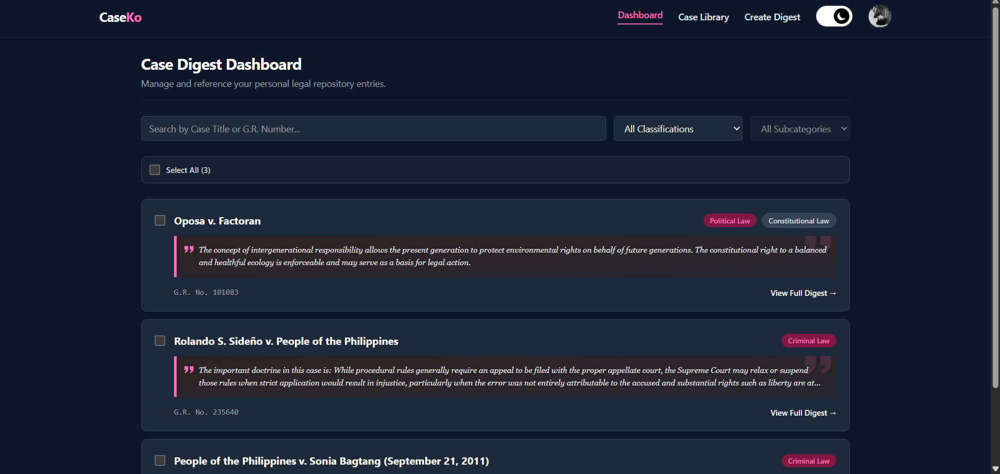

# CaseKo

A personal case digest repository for Philippine jurisprudence — built to organize, search, and review case law while studying for the Bar.

**[Live Demo](#)** · Built with Next.js, Supabase, and Tailwind CSS

---

## Why I built this

Reviewing Philippine jurisprudence for the Bar means keeping track of hundreds of cases — their doctrines, facts, and rulings — in a way that's actually searchable and easy to revisit. Existing note-taking tools weren't built for this specific workflow, so I built CaseKo to be a purpose-made repository: create a digest for each case, tag it by legal classification, highlight the doctrine, and search across your whole library when you need to find something fast.

## Features

- **Case Digests** — create, edit, and organize case digests with title, G.R. number, classification, doctrine, facts, issue, and ruling
- **Dashboard & Library** — a working dashboard with search/filter/batch actions, and a library view grouped by legal classification
- **Doctrine Highlights** — key doctrines are visually pulled out and easy to scan at a glance
- **Full-text source links** — auto-generated links to Philippine legal repositories for the complete official decision
- **Print / Export to PDF** — clean, print-ready formatting for any case digest
- **Data export/import** — back up your entire repository as JSON or CSV, or restore from a previous export
- **Dark mode** — full dark/light theme support across every page
- **Account management** — change email/password, or delete your account and all associated data
- **Row-Level Security** — every user's data is isolated at the database level via Supabase RLS, not just app-level checks

## Tech Stack

- **Framework:** [Next.js](https://nextjs.org/) (App Router)
- **Database & Auth:** [Supabase](https://supabase.com/) (Postgres, Auth, Storage, Row-Level Security)
- **Styling:** [Tailwind CSS](https://tailwindcss.com/) v4
- **Language:** TypeScript
- **Deployment:** [Vercel](https://vercel.com/)

## Getting Started

### Prerequisites

- Node.js 18+
- A [Supabase](https://supabase.com/) project

### Setup

1. Clone the repo
   ```bash
   git clone https://github.com/your-username/caseko.git
   cd caseko
   npm install
   ```

2. Create a `.env.local` file in the project root:
   ```dotenv
   NEXT_PUBLIC_SUPABASE_URL=your-supabase-project-url
   NEXT_PUBLIC_SUPABASE_ANON_KEY=your-supabase-anon-key
   SUPABASE_SERVICE_ROLE_KEY=your-supabase-service-role-key
   ```
   > The service role key is required for account deletion (`/api/account/delete`) and must never be prefixed with `NEXT_PUBLIC_`.

3. Run the database migrations in `supabase/migrations/` via the Supabase SQL Editor.

4. Start the dev server:
   ```bash
   npm run dev
   ```

5. Open [http://localhost:3000](http://localhost:3000).

### Deploying

This project deploys cleanly to Vercel:

1. Push to GitHub, then import the repo in Vercel
2. Add the three environment variables above in the Vercel project settings
3. Deploy
4. In Supabase, update **Authentication → URL Configuration** with your production domain (Site URL + Redirect URLs)

## Screenshots


  
  

  
## Project Structure

```
app/
  ├─ dashboard/       # Main case digest dashboard
  ├─ library/         # Case library, grouped by classification
  ├─ create/          # Create new case digest
  ├─ case/[id]/       # Case detail view + edit
  ├─ profile/         # Account settings, data export/import
  ├─ login/           # Auth (sign in / register)
  └─ api/account/     # Server-side account deletion
components/           # Shared UI components
lib/supabase/         # Supabase client, server, and admin clients
supabase/migrations/  # Database schema and trigger definitions
```

## License

MIT

---

Built by [Your Name](https://github.com/your-username) — feedback and issues welcome.